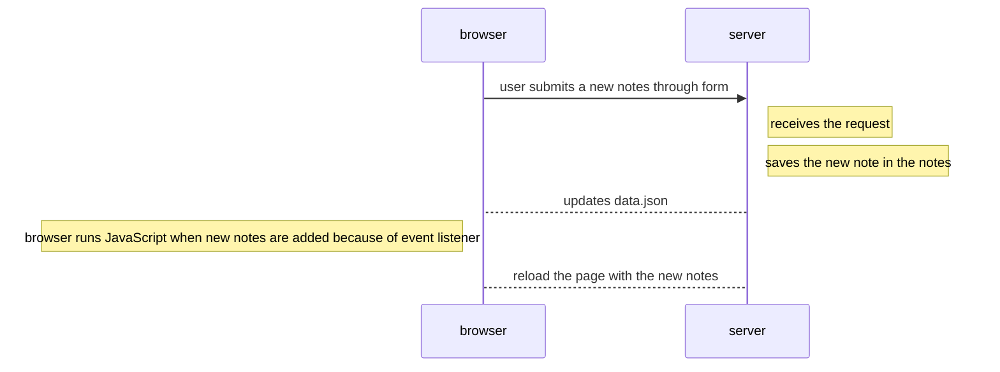

# New Note Diagram
A sequence diagram to show what is happening when a user submits a new note.

```mermaid
sequenceDiagram
  browser->>server: user submits a new notes through form
  Note right of server: receives the request
  Note right of server: saves the new note in the notes
  server-->browser: updates data.json
  Note left of browser: browser runs JavaScript when new notes are added because of event listener
  browser-->server: reload the page with the new notes
```