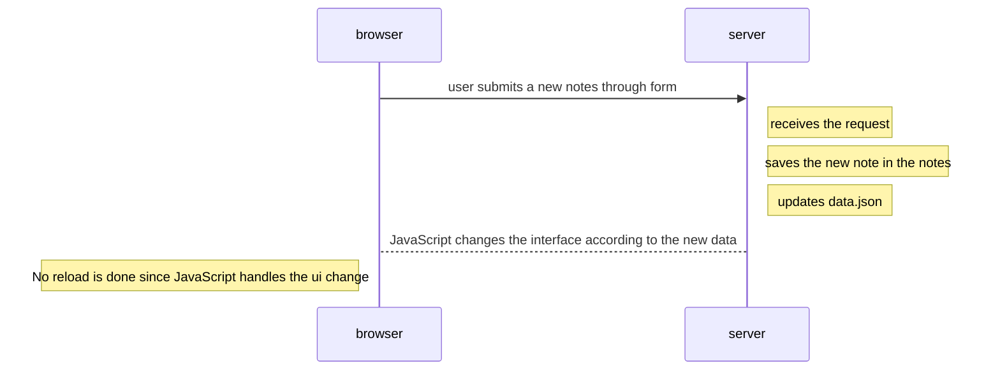

# Single Page App Diagram

```mermaid
sequenceDiagram
  browser->>server: user submits a new notes through form
  Note right of server: receives the request
  Note right of server: saves the new note in the notes
  Note right of server: updates data.json
  server-->browser: JavaScript changes the interface according to the new data
  Note left of browser: No reload is done since JavaScript handles the ui change
```