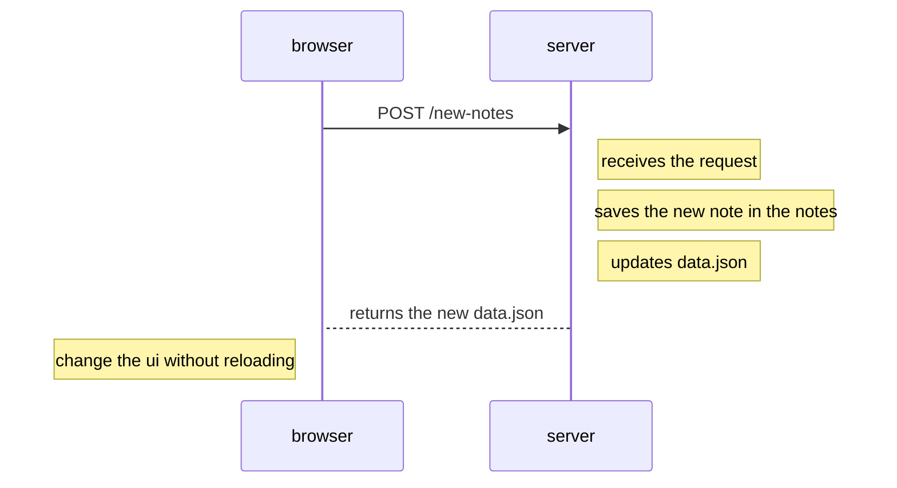

# Single Page App Diagram

```mermaid
sequenceDiagram
  browser->>server: POST /new-notes
  Note right of server: receives the request
  Note right of server: saves the new note in the notes
  Note right of server: updates data.json
  server-->browser: returns the new data.json
  Note left of browser: change the ui without reloading
```